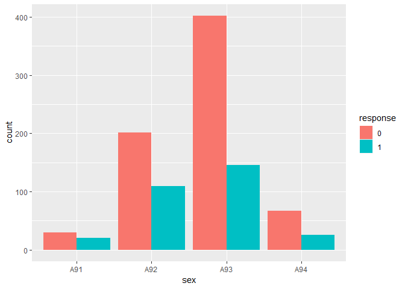

## German Credit Data Risk Analysis

The German credit scoring data is a dataset provided by Prof. Hogmann in the file german.data. The data set has information about 1000 individuals, on the basis of which they have been classified as risky or not. The variable response in the dataset corresponds to the risk label, 1 has been classified as bad and 2 has been classified as good.

Initially, exploratory data analysis on the dataset has been performed. Further, a logistic regression model has been built to predict customers as risky or not, along with variable selection for the model building process.


## Libraries Used

The following libraries have been used for the analyses:


```r
library(knitr)
library(dplyr)
library(tidyr)
library(reshape2)
library(RColorBrewer)
library(GGally)
library(ggplot2)
library(caret)
library(glmnet)
library(boot)
library(verification)
```

## Exploratory Data Analysis

### Data Import
The data is downloaded from the link. Further, column names are put and the response labels changed to 1 and 0:
0 corresponding to a good credit record and 1 corresponding to a bad one (positive class).


```r
german_credit <- read.table("http://archive.ics.uci.edu/ml/machine-learning-databases/statlog/german/german.data")

colnames(german_credit) <- c("chk_acct", "duration", "credit_his", "purpose", 
                            "amount", "saving_acct", "present_emp", "installment_rate", "sex", "other_debtor", 
                            "present_resid", "property", "age", "other_install", "housing", "n_credits", 
                            "job", "n_people", "telephone", "foreign", "response")

german_credit$response <- german_credit$response - 1
german_credit$response <- as.factor(german_credit$response)
```

### Data Structure

There are a total of 21 attributes in the dataset. Their descriptions and details have been tabulated below:

* Status of existing checking account.
* Duration in month
* Credit history
* Purpose
* Credit amount
* Savings account/bonds
* Present employment since
* Installment rate in percentage of disposable income
* Personal status and sex
* Other debtors / guarantors
* Present residence since
* Property
* Age in years
* Other installment plans
* Housing
* Number of existing credits at this bank
* Job
* Number of people being liable to provide maintenance for
* Telephone
* Foreign worker


```r
glimpse(german_credit)
```

```
## Observations: 1,000
## Variables: 21
## $ chk_acct         <fct> A11, A12, A14, A11, A11, A14, A14, A12, A14, ...
## $ duration         <int> 6, 48, 12, 42, 24, 36, 24, 36, 12, 30, 12, 48...
## $ credit_his       <fct> A34, A32, A34, A32, A33, A32, A32, A32, A32, ...
## $ purpose          <fct> A43, A43, A46, A42, A40, A46, A42, A41, A43, ...
## $ amount           <int> 1169, 5951, 2096, 7882, 4870, 9055, 2835, 694...
## $ saving_acct      <fct> A65, A61, A61, A61, A61, A65, A63, A61, A64, ...
## $ present_emp      <fct> A75, A73, A74, A74, A73, A73, A75, A73, A74, ...
## $ installment_rate <int> 4, 2, 2, 2, 3, 2, 3, 2, 2, 4, 3, 3, 1, 4, 2, ...
## $ sex              <fct> A93, A92, A93, A93, A93, A93, A93, A93, A91, ...
## $ other_debtor     <fct> A101, A101, A101, A103, A101, A101, A101, A10...
## $ present_resid    <int> 4, 2, 3, 4, 4, 4, 4, 2, 4, 2, 1, 4, 1, 4, 4, ...
## $ property         <fct> A121, A121, A121, A122, A124, A124, A122, A12...
## $ age              <int> 67, 22, 49, 45, 53, 35, 53, 35, 61, 28, 25, 2...
## $ other_install    <fct> A143, A143, A143, A143, A143, A143, A143, A14...
## $ housing          <fct> A152, A152, A152, A153, A153, A153, A152, A15...
## $ n_credits        <int> 2, 1, 1, 1, 2, 1, 1, 1, 1, 2, 1, 1, 1, 2, 1, ...
## $ job              <fct> A173, A173, A172, A173, A173, A172, A173, A17...
## $ n_people         <int> 1, 1, 2, 2, 2, 2, 1, 1, 1, 1, 1, 1, 1, 1, 1, ...
## $ telephone        <fct> A192, A191, A191, A191, A191, A192, A191, A19...
## $ foreign          <fct> A201, A201, A201, A201, A201, A201, A201, A20...
## $ response         <fct> 0, 1, 0, 0, 1, 0, 0, 0, 0, 1, 1, 1, 0, 1, 0, ...
```

### Summary Statistics

The following table provides the summary statistics of the dataset. The dataset has a total of 1000 observations with 21 variables, out of which 8 are numerical variables including the response and 13 are categorical variables with various levels. The summary statistics for the variables are presented below -


```r
summary(german_credit)
```

```
##  chk_acct     duration    credit_his    purpose        amount     
##  A11:274   Min.   : 4.0   A30: 40    A43    :280   Min.   :  250  
##  A12:269   1st Qu.:12.0   A31: 49    A40    :234   1st Qu.: 1366  
##  A13: 63   Median :18.0   A32:530    A42    :181   Median : 2320  
##  A14:394   Mean   :20.9   A33: 88    A41    :103   Mean   : 3271  
##            3rd Qu.:24.0   A34:293    A49    : 97   3rd Qu.: 3972  
##            Max.   :72.0              A46    : 50   Max.   :18424  
##                                      (Other): 55                  
##  saving_acct present_emp installment_rate  sex      other_debtor
##  A61:603     A71: 62     Min.   :1.000    A91: 50   A101:907    
##  A62:103     A72:172     1st Qu.:2.000    A92:310   A102: 41    
##  A63: 63     A73:339     Median :3.000    A93:548   A103: 52    
##  A64: 48     A74:174     Mean   :2.973    A94: 92               
##  A65:183     A75:253     3rd Qu.:4.000                          
##                          Max.   :4.000                          
##                                                                 
##  present_resid   property        age        other_install housing   
##  Min.   :1.000   A121:282   Min.   :19.00   A141:139      A151:179  
##  1st Qu.:2.000   A122:232   1st Qu.:27.00   A142: 47      A152:713  
##  Median :3.000   A123:332   Median :33.00   A143:814      A153:108  
##  Mean   :2.845   A124:154   Mean   :35.55                           
##  3rd Qu.:4.000              3rd Qu.:42.00                           
##  Max.   :4.000              Max.   :75.00                           
##                                                                     
##    n_credits       job         n_people     telephone  foreign    response
##  Min.   :1.000   A171: 22   Min.   :1.000   A191:596   A201:963   0:700   
##  1st Qu.:1.000   A172:200   1st Qu.:1.000   A192:404   A202: 37   1:300   
##  Median :1.000   A173:630   Median :1.000                                 
##  Mean   :1.407   A174:148   Mean   :1.155                                 
##  3rd Qu.:2.000              3rd Qu.:1.000                                 
##  Max.   :4.000              Max.   :2.000                                 
## 
```


### EDA for continuous variables

The following insights is obtained from the EDA of continuous variables:

* From the `age` variable, we see that the median value for bad records is lesser than that of good records, it might be premature to say young people tend to have bad credit records, but we can safely assume it tends to be riskier.

* The `installment_rate` variable has a great deal of difference between the good and bad records, we see that bad records have almost the double median value than good ones.

* The median value and the range of the `duration` variable appears to be on the higher side of bad records as compared to good records
    
* For the `amount` variable, we observe that the amount for bad records is larger in general as compared to good ones

* We further built on this by plotting the density curve along the vertical line for their mean value and find that there is a great deal of difference for the `duration` as well as `amount` variable.


#### `Duration` variable

```r
amount.mean <- german_credit %>% dplyr::select(amount, response) %>% group_by(response) %>% summarise(m =mean(amount))
duration.mean <- german_credit %>% dplyr::select(duration, response) %>%group_by(response) %>% summarise( m =mean(duration))

ggplot(german_credit, aes(duration, fill=response)) + 
  geom_density(alpha=.5) + geom_vline(data=duration.mean, aes(xintercept=m,  colour=response),
                                      linetype="dashed", size=1)
```

<!-- -->


```r
test.m <- german_credit[,c(2,5,8,13,16,18,21)]
test.m$response <- as.numeric(test.m$response)
ggplot(melt(german_credit[,c(2,21)]), aes(x = variable, y = value, fill = response)) + geom_boxplot() + xlab("response") + ylab("duration")
```

<!-- -->


#### `Installment Rate` variable

```r
ggplot(german_credit, aes(factor(installment_rate), ..count..)) + 
  geom_bar(aes(fill = response), position = "dodge") + xlab("Installment Rates")
```

<!-- -->

#### `Amount` variable

```r
ggplot(german_credit, aes(amount, fill=response)) + 
  geom_density(alpha=.5) + geom_vline(data=amount.mean, aes(xintercept=m,  colour=response),
                                      linetype="dashed", size=1)
```

<!-- -->

```r
ggplot(melt(german_credit[,c(5,21)]), aes(x = variable, y = value, fill = response)) + 
geom_boxplot() + xlab("response") + ylab("amount")
```

<!-- -->

#### `Age` variable

```r
ggplot(melt(german_credit[,c(13,21)]), aes(x = variable, y = value, fill = response)) + 
geom_boxplot()+ xlab("response") + ylab("age")
```

<!-- -->

#### `n_credits` variable

```r
ggplot(melt(german_credit[,c(16,21)]), aes(x = variable, y = value, fill = response)) + 
geom_boxplot()
```

<!-- -->


### EDA for categorical variables
The following insights are derived from EDA of categorical variables:

* For `chk_acct` we see that, the current status of the checking account matters as the frequency of the response variables is seen to differ from one sub category to another, overall A11 houses more number of bad credit records and A14 the least

* For `credit_his`, we observe that proportion of the response variable varies significantly, for categories A30, A31 we see the number of bad credit records are greater.

* For the `purpose` variable, we observe that the proportion of good and bad credit record varies also overall A44, A45, A410 and A46 seem to include more risky records.

* We also observe these trends in other variables like `sex`, `other_debtor`, `saving_acct`, `other_install` and `foreign`. Overall, the trend looks significant in `saving_acct`, `purpose`, `credit_his` and `chk_acct` as compared to others.

#### `chk_acct` variable

```r
ggplot(german_credit, aes(chk_acct, ..count..)) + 
  geom_bar(aes(fill = response), position = "dodge") 
```

<!-- -->

#### `credit_his` variable

```r
ggplot(german_credit, aes(credit_his, ..count..)) + 
  geom_bar(aes(fill = response), position = "dodge") 
```

<!-- -->

#### `purpose` variable

```r
ggplot(german_credit, aes(purpose, ..count..)) + 
  geom_bar(aes(fill = response), position = "dodge") 
```

<!-- -->

#### `saving_acct` variable

```r
ggplot(german_credit, aes(saving_acct, ..count..)) + 
  geom_bar(aes(fill = response), position = "dodge")
```

<!-- -->

#### `other_debtor` variable

```r
ggplot(german_credit, aes(other_debtor, ..count..)) + 
  geom_bar(aes(fill = response), position = "dodge")
```

<!-- -->

#### `sex` variable

```r
ggplot(german_credit, aes(sex, ..count..)) + 
  geom_bar(aes(fill = response), position = "dodge") 
```

<!-- -->

#### `other_install` variable

```r
ggplot(german_credit, aes(other_install, ..count..)) + 
  geom_bar(aes(fill = response), position = "dodge") 
```

<!-- -->

#### `foreign` variable

```r
ggplot(german_credit, aes(foreign, ..count..)) + 
  geom_bar(aes(fill = response), position = "dodge")
```

<!-- -->


## Logistic Regression to Predict Riskiness

A logistic regression model is built to predict riskiness

### Train/Test split

Splitting the data into 80:20, train test split using stratifiesd sampling in order to get equal amount of data from each response class

```r
set.seed(12420246)
in.train <- createDataPartition(as.factor(german_credit$response), p=0.8, list=FALSE)
german_credit.train <- german_credit[in.train,]
german_credit.test <- german_credit[-in.train,]
```

### Stepwise variable selection using AIC

From stepwise variable selection method using AIC, the significant variables are:

* chk_acct
* duration
* credit_his
* purpose
* amount
* saving_acct
* installment_rate
* sex
* other_debtor
* telephone
* present_emp
* foreign


```r
credit.glm0 <- glm(response ~ ., family = binomial, german_credit.train)
credit.glm.step <- step(credit.glm0, direction = "backward")
```

```r
summary(credit.glm.step)
```

```
## 
## Call:
## glm(formula = response ~ chk_acct + duration + credit_his + purpose + 
##     amount + saving_acct + present_emp + installment_rate + sex + 
##     other_debtor + telephone + foreign, family = binomial, data = german_credit.train)
## 
## Deviance Residuals: 
##     Min       1Q   Median       3Q      Max  
## -2.2857  -0.6895  -0.3733   0.7055   2.7976  
## 
## Coefficients:
##                    Estimate Std. Error z value Pr(>|z|)    
## (Intercept)      -1.201e-01  7.864e-01  -0.153 0.878576    
## chk_acctA12      -5.798e-01  2.452e-01  -2.365 0.018044 *  
## chk_acctA13      -1.279e+00  4.169e-01  -3.069 0.002150 ** 
## chk_acctA14      -1.868e+00  2.522e-01  -7.407 1.29e-13 ***
## duration          2.473e-02  9.971e-03   2.481 0.013116 *  
## credit_hisA31     2.702e-01  5.894e-01   0.458 0.646702    
## credit_hisA32    -7.761e-01  4.565e-01  -1.700 0.089097 .  
## credit_hisA33    -8.074e-01  5.102e-01  -1.583 0.113530    
## credit_hisA34    -1.610e+00  4.787e-01  -3.364 0.000769 ***
## purposeA41       -1.603e+00  4.071e-01  -3.938 8.21e-05 ***
## purposeA410      -1.468e+00  9.250e-01  -1.587 0.112443    
## purposeA42       -5.899e-01  2.843e-01  -2.075 0.038011 *  
## purposeA43       -7.986e-01  2.768e-01  -2.885 0.003910 ** 
## purposeA44       -6.559e-01  7.825e-01  -0.838 0.401908    
## purposeA45       -1.853e-01  5.767e-01  -0.321 0.747988    
## purposeA46        1.016e-01  4.565e-01   0.223 0.823789    
## purposeA48       -1.568e+01  4.811e+02  -0.033 0.974008    
## purposeA49       -3.881e-01  3.639e-01  -1.067 0.286099    
## amount            1.752e-04  4.894e-05   3.579 0.000345 ***
## saving_acctA62   -2.083e-01  3.125e-01  -0.666 0.505143    
## saving_acctA63   -3.164e-01  4.657e-01  -0.679 0.496880    
## saving_acctA64   -1.107e+00  6.020e-01  -1.839 0.065960 .  
## saving_acctA65   -1.081e+00  2.903e-01  -3.722 0.000198 ***
## present_empA72    4.165e-01  4.169e-01   0.999 0.317803    
## present_empA73    1.365e-01  3.897e-01   0.350 0.726136    
## present_empA74   -6.962e-01  4.362e-01  -1.596 0.110482    
## present_empA75    1.082e-01  4.071e-01   0.266 0.790352    
## installment_rate  3.071e-01  9.595e-02   3.201 0.001371 ** 
## sexA92            1.751e-01  4.223e-01   0.415 0.678489    
## sexA93           -3.223e-01  4.118e-01  -0.783 0.433895    
## sexA94            2.329e-01  5.050e-01   0.461 0.644669    
## other_debtorA102  1.550e-01  4.730e-01   0.328 0.743117    
## other_debtorA103 -1.232e+00  5.000e-01  -2.464 0.013723 *  
## telephoneA192    -3.336e-01  2.097e-01  -1.591 0.111658    
## foreignA202      -1.108e+00  6.531e-01  -1.697 0.089791 .  
## ---
## Signif. codes:  0 '***' 0.001 '**' 0.01 '*' 0.05 '.' 0.1 ' ' 1
## 
## (Dispersion parameter for binomial family taken to be 1)
## 
##     Null deviance: 977.38  on 799  degrees of freedom
## Residual deviance: 717.93  on 765  degrees of freedom
## AIC: 787.93
## 
## Number of Fisher Scoring iterations: 14
```

### Stepwise variable selection using BIC

From stepwise variable selection method using BIC, the significant variables are:

* chk_acct
* credit_his
* amount
* duration


```r
credit.glm.step.bic <- step(credit.glm0, k = log(nrow(german_credit.train)))
```


```r
summary(credit.glm.step.bic)
```

```
## 
## Call:
## glm(formula = response ~ chk_acct + credit_his + amount + installment_rate, 
##     family = binomial, data = german_credit.train)
## 
## Deviance Residuals: 
##     Min       1Q   Median       3Q      Max  
## -1.9989  -0.7938  -0.4832   0.8709   2.4650  
## 
## Coefficients:
##                    Estimate Std. Error z value Pr(>|z|)    
## (Intercept)      -2.515e-01  5.132e-01  -0.490 0.624031    
## chk_acctA12      -6.511e-01  2.116e-01  -3.077 0.002091 ** 
## chk_acctA13      -1.125e+00  3.832e-01  -2.936 0.003324 ** 
## chk_acctA14      -1.971e+00  2.284e-01  -8.629  < 2e-16 ***
## credit_hisA31    -2.816e-01  5.228e-01  -0.539 0.590188    
## credit_hisA32    -1.003e+00  4.066e-01  -2.468 0.013578 *  
## credit_hisA33    -8.566e-01  4.694e-01  -1.825 0.068050 .  
## credit_hisA34    -1.764e+00  4.327e-01  -4.076 4.58e-05 ***
## amount            1.573e-04  3.237e-05   4.860 1.17e-06 ***
## installment_rate  2.805e-01  8.444e-02   3.321 0.000896 ***
## ---
## Signif. codes:  0 '***' 0.001 '**' 0.01 '*' 0.05 '.' 0.1 ' ' 1
## 
## (Dispersion parameter for binomial family taken to be 1)
## 
##     Null deviance: 977.38  on 799  degrees of freedom
## Residual deviance: 808.69  on 790  degrees of freedom
## AIC: 828.69
## 
## Number of Fisher Scoring iterations: 4
```

### Lasso variable selection

To get variable selection using LASSO, the dataset is converted into a matrix form.


```r
factor_var <- c(1,3,4,6,7,9,10,12,14,15,17,19,20,21)
num_var <- c(2,5,8,11,13,16,18)
train2 <- german_credit.train
train2[num_var] <- scale(train2[num_var])
train2[factor_var] <- sapply(train2[factor_var] , as.numeric)

X.train <- as.matrix(train2[,1:20])
Y.train <- as.matrix(train2[,21])
```

We fit the LASSO model to our data. From the plot below, we see that as the value of lambda keeps on increasing, the coefficients for the variables tend to 0.

```r
lasso.fit<- glmnet(x=X.train, y=Y.train, family = "binomial", alpha = 1)
plot(lasso.fit, xvar = "lambda", label=TRUE)
```

<!-- -->

Using cross validation to find perfect lambda value


```r
cv.lasso<- cv.glmnet(x=X.train, y=Y.train, family = "binomial", alpha = 1, nfolds = 10)
plot(cv.lasso)
```

<!-- -->

Error associated with model with lambda=1se and coefficients of model

```r
cv.lasso$lambda.1se
```

```
## [1] 0.05305367
```

```r
coef(lasso.fit, s=cv.lasso$lambda.1se)
```

```
## 21 x 1 sparse Matrix of class "dgCMatrix"
##                            1
## (Intercept)       0.67348675
## chk_acct         -0.39099034
## duration          0.17630057
## credit_his       -0.14902192
## purpose           .         
## amount            0.01203952
## saving_acct      -0.02363415
## present_emp       .         
## installment_rate  .         
## sex               .         
## other_debtor      .         
## present_resid     .         
## property          .         
## age               .         
## other_install     .         
## housing           .         
## n_credits         .         
## job               .         
## n_people          .         
## telephone         .         
## foreign           .
```

### Final logistic model for GLM

For our final model, we select the following variables:

* chk_acct
* duration
* credit_his
* amount
* saving_acct
* installment_rate
* other_install


```r
credit.glm.final <- glm(response ~ chk_acct + duration + credit_his + amount + saving_acct + other_install + installment_rate, family = binomial, german_credit.train)

summary(credit.glm.final)
```

```
## 
## Call:
## glm(formula = response ~ chk_acct + duration + credit_his + amount + 
##     saving_acct + other_install + installment_rate, family = binomial, 
##     data = german_credit.train)
## 
## Deviance Residuals: 
##     Min       1Q   Median       3Q      Max  
## -1.9407  -0.7754  -0.4474   0.8484   2.4526  
## 
## Coefficients:
##                     Estimate Std. Error z value Pr(>|z|)    
## (Intercept)       -4.489e-01  5.659e-01  -0.793 0.427627    
## chk_acctA12       -5.410e-01  2.217e-01  -2.441 0.014666 *  
## chk_acctA13       -1.046e+00  3.916e-01  -2.673 0.007529 ** 
## chk_acctA14       -1.792e+00  2.357e-01  -7.601 2.94e-14 ***
## duration           2.099e-02  9.177e-03   2.287 0.022193 *  
## credit_hisA31     -1.233e-01  5.424e-01  -0.227 0.820153    
## credit_hisA32     -7.752e-01  4.145e-01  -1.870 0.061460 .  
## credit_hisA33     -7.795e-01  4.789e-01  -1.628 0.103561    
## credit_hisA34     -1.599e+00  4.398e-01  -3.636 0.000277 ***
## amount             1.144e-04  4.187e-05   2.733 0.006277 ** 
## saving_acctA62    -7.802e-02  2.922e-01  -0.267 0.789475    
## saving_acctA63    -2.399e-01  4.441e-01  -0.540 0.589066    
## saving_acctA64    -1.014e+00  5.802e-01  -1.747 0.080598 .  
## saving_acctA65    -9.433e-01  2.652e-01  -3.557 0.000375 ***
## other_installA142  2.245e-01  4.446e-01   0.505 0.613689    
## other_installA143 -1.236e-01  2.567e-01  -0.481 0.630289    
## installment_rate   2.480e-01  8.885e-02   2.791 0.005257 ** 
## ---
## Signif. codes:  0 '***' 0.001 '**' 0.01 '*' 0.05 '.' 0.1 ' ' 1
## 
## (Dispersion parameter for binomial family taken to be 1)
## 
##     Null deviance: 977.38  on 799  degrees of freedom
## Residual deviance: 786.28  on 783  degrees of freedom
## AIC: 820.28
## 
## Number of Fisher Scoring iterations: 5
```

## Model Evaluation

### In-sample misclassification rate

Keeping cutoff probability as 0.1667, the misclassification rate is:


```r
prob.glm1.insample <- predict(credit.glm.final, type = "response")
predicted.glm1.insample <- prob.glm1.insample > 0.1667
predicted.glm1.insample <- as.numeric(predicted.glm1.insample)
mean(ifelse(german_credit.train$response != predicted.glm1.insample, 1, 0))
```

```
## [1] 0.40125
```

### Confusion Matrix

Checking for the predictions and seeing the False Positive and False negative values from the below confusion matrix:


```r
table(german_credit.train$response, predicted.glm1.insample, dnn = c("Truth", "Predicted"))
```

```
##      Predicted
## Truth   0   1
##     0 264 296
##     1  25 215
```

### ROC Plot

ROC Plot is plotted below and the AUC is 0.7896875

```r
roc.plot(german_credit.train$response == "1", prob.glm1.insample)
roc.plot(german_credit.train$response == "1", prob.glm1.insample)$roc.vol$Area
```

<!-- -->

```
## [1] 0.7911458
```

### Out of sample misclassification rate and AUC score

We get a misclassification rate of 0.395, and AUC of 0.7734524

```r
prob.glm1.outsample <- predict(credit.glm.final, german_credit.test, type = "response")
predicted.glm1.outsample <- prob.glm1.outsample > 0.1667
predicted.glm1.outsample <- as.numeric(predicted.glm1.outsample)
table(german_credit.test$response, predicted.glm1.outsample, dnn = c("Truth", "Predicted"))
```

```
##      Predicted
## Truth  0  1
##     0 58 82
##     1  9 51
```

```r
mean(ifelse(german_credit.test$response != predicted.glm1.outsample, 1, 0))
```

```
## [1] 0.455
```

```r
roc.plot(german_credit.test$response == "1", prob.glm1.outsample)
roc.plot(german_credit.test$response == "1", prob.glm1.outsample)$roc.vol$Area
```

<!-- -->

```
## [1] 0.762619
```

### Asymmetric misclassification rate giving more penalty for false positives

In cases where we need to penalize the False Negative more than False Positive, we use a 5:1 penalty for misclassification and see an error rate of 0.535

```r
cost1 <- function(r, pi) {
  weight1 = 5
  weight0 = 1
  c1 = (r == 1) & (pi < 0.17)  #logical vector - true if actual 1 but predict 0
  c0 = (r == 0) & (pi > 0.17)  #logical vecotr - true if actual 0 but predict 1
  return(mean(weight1 * c1 + weight0 * c0))
}

cost1(german_credit.test$response,predicted.glm1.outsample)
```

```
## [1] 0.635
```
